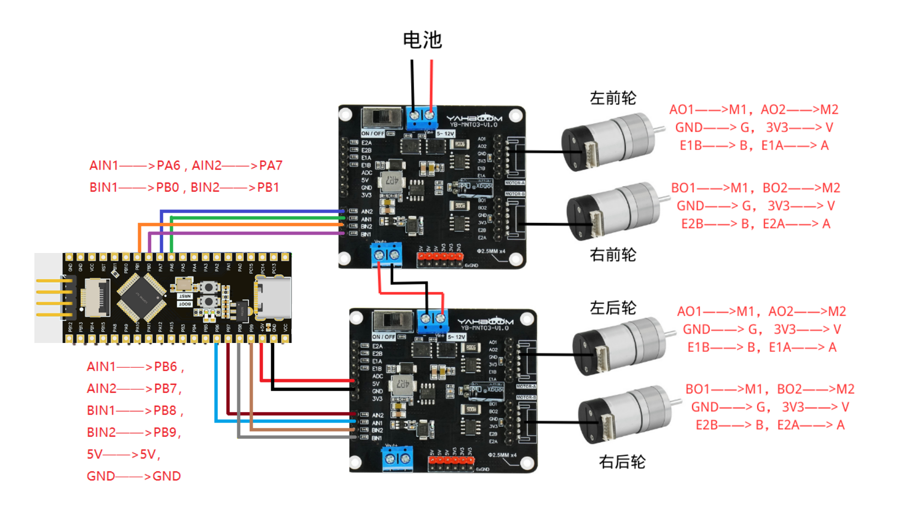

# 电机驱动实验

### 1、**实验目的**

​	烧录电机驱动代码，将GD32f103c8t6主控板上电后，启动小车的电机驱动功能，实验效果为小车前进1s，后退1s，左旋1s， 右旋1s， 停止，然后循环以上步骤。

### 2、**实验原理**

​	对于4路编码器电机310的控制我们采用的是两个双路电机驱动板来驱动电机。通过控制驱动芯片的AIN1,AIN2,BIN1,BIN2的电平高低来控制电机的正转，反转，停止；通过驱动板上的E1A，E1B，E2A，E2B来获取电机的编码值，进而实现pid调速。

**双路电机驱动模块：**

**双路电机驱动方式：**

输入管脚IN1/IN2控制H桥的输出状态，下表是输入输出间的逻辑关系：

当使用PWM控制来实现调速功能时，H桥可以操作在两种不同的状态，快衰减或者慢衰减。在快衰减模式，H桥是被禁止的，续流电流流经二极管；在慢衰减模式，输出H桥的两个下管都是打开的。

### 3、实验步骤

​	将两个双路电机驱动板与GD32主控板按下图连接起来。

**注意：**310电机的接线需要按图中引脚标注连接，不可以随意连接，也不可自行更换成排插，否则会烧毁驱动板！

接线完成之后，烧录电机驱动代码，小车前进1s，后退1s，左旋1s， 右旋1s， 停止，然后重复循环以上步骤。

### 4、主要代码展示

	#include "moto.h"
	#include "PWM.h"
	
	/**************************************************************************
	函数功能：电机的正反转
	入口参数：
	返回  值：无
	**************************************************************************/
	
	void Forward(int Speed)
	{
			PWMA_IN1=Speed;PWMA_IN2=0;  //左前轮  Speed=6000
			PWMB_IN1=0;PWMB_IN2=Speed;  //右前轮
			PWMC_IN1=0;PWMC_IN2=Speed;  //右后轮
			PWMD_IN1=Speed;PWMD_IN2=0;  //左后轮
	}
	void Backward(int Speed)
	{
	
		  PWMA_IN1=0;PWMA_IN2=Speed;
		  PWMB_IN1=Speed;PWMB_IN2=0;
			PWMC_IN1=Speed;PWMC_IN2=0;
		  PWMD_IN1=0;PWMD_IN2=Speed;		
			
		}
	void Turnleft(int Speed)
	{
			PWMA_IN1=0;PWMA_IN2=0;
			PWMB_IN1=0;PWMB_IN2=Speed; //Speed=6500   
			PWMC_IN1=0;PWMC_IN2=Speed;
			PWMD_IN1=0;PWMD_IN2=0;
	}
	void Turnright(int Speed)
	{
			PWMA_IN1=Speed;PWMA_IN2=0;//Speed=6500
			PWMB_IN1=0;PWMB_IN2=0;
			PWMC_IN1=0;PWMC_IN2=0;
			PWMD_IN1=Speed;PWMD_IN2=0;
	}
	void Stop(void)
	{
			PWMA_IN1=0;PWMA_IN2=0;
			PWMB_IN1=0;PWMB_IN2=0;
			PWMC_IN1=0;PWMC_IN2=0;
			PWMD_IN1=0;PWMD_IN2=0;
	}
	void SpinLeft(int Speed)   //左轮后退右轮前进     电池7.9V左右左旋90度左右   （满电8.43V）//Speed=7000
	{
			PWMA_IN1=0;PWMA_IN2=Speed;
			PWMB_IN1=0;PWMB_IN2=Speed;
			PWMC_IN1=0;PWMC_IN2=Speed;
			PWMD_IN1=0;PWMD_IN2=Speed;
	}
	void SpinRight(int Speed)   //左轮前进右轮后退      电池7.9V左右左旋90度左右
	{
			PWMA_IN1=Speed;PWMA_IN2=0;//Speed=7000
			PWMB_IN1=Speed;PWMB_IN2=0;
		PWMC_IN1=Speed;PWMC_IN2=0;
			PWMD_IN1=Speed;PWMD_IN2=0;
	}

	#include "pwm.h"
	/**************************************************************************
	函数功能：pwm初始化
	入口参数：arr：设为一个时钟频率的最大值  psc： 预分频值
	返回  值：无
	**************************************************************************/
	
	void PWM_Int(u16 arr,u16 psc,u16 arr2,u16 psc2 )
	{
		GPIO_InitTypeDef GPIO_InitStructure;                //定义结构体GPIO_InitStructure
		TIM_TimeBaseInitTypeDef TIM_TimeBaseStructure;      //定义结构体TIM_TimeBaseStructure   
		TIM_OCInitTypeDef TIM_OCInitStructure;              //定义结构体TIM_OCInitStructure
		
		RCC_APB2PeriphClockCmd(RCC_APB2Periph_GPIOA|RCC_APB2Periph_GPIOB,ENABLE);//使能PB端口时钟
		RCC_APB1PeriphClockCmd(RCC_APB1Periph_TIM3,ENABLE);//使能定时器3
		
		GPIO_InitStructure.GPIO_Mode = GPIO_Mode_AF_PP;
		GPIO_InitStructure.GPIO_Pin  = GPIO_Pin_6|GPIO_Pin_7;
		GPIO_InitStructure.GPIO_Speed= GPIO_Speed_2MHz;
		GPIO_Init(GPIOA,&GPIO_InitStructure);
		
		GPIO_InitStructure.GPIO_Mode = GPIO_Mode_AF_PP;         //复用模式输出
		GPIO_InitStructure.GPIO_Pin  = GPIO_Pin_0|GPIO_Pin_1; //PB0 、PB1
		GPIO_InitStructure.GPIO_Speed= GPIO_Speed_2MHz;        //IO口速度
		GPIO_Init(GPIOB,&GPIO_InitStructure);        	//GPIO初始化
		
		TIM_TimeBaseStructure.TIM_Period = arr;                //设置下一个更新活动的自动重装载寄存器的值
		TIM_TimeBaseStructure.TIM_Prescaler = psc;             //预分配值
		TIM_TimeBaseStructure.TIM_ClockDivision = 0;           //时钟分割
		TIM_TimeBaseStructure.TIM_CounterMode = TIM_CounterMode_Up; //向上计数
		TIM_TimeBaseInit(TIM3,&TIM_TimeBaseStructure);
		
		TIM_OCInitStructure.TIM_OCMode= TIM_OCMode_PWM1;             //PWM脉冲宽度调制1
		TIM_OCInitStructure.TIM_Pulse = 0;                           //设置待装入捕获比较寄存器的脉冲值
		TIM_OCInitStructure.TIM_OCPolarity = TIM_OCPolarity_High;    //设置TIM输出极性为高
		TIM_OCInitStructure.TIM_OutputState = TIM_OutputState_Enable;//比较输出使能
		TIM_OC1Init(TIM3,&TIM_OCInitStructure);
		TIM_OC2Init(TIM3,&TIM_OCInitStructure);
		TIM_OC3Init(TIM3,&TIM_OCInitStructure);
		TIM_OC4Init(TIM3,&TIM_OCInitStructure);
		
		TIM_CtrlPWMOutputs(TIM3,ENABLE);//主输出使能
		
		TIM_OC1PreloadConfig(TIM3,TIM_OCPreload_Enable);
		TIM_OC2PreloadConfig(TIM3,TIM_OCPreload_Enable);
		TIM_OC3PreloadConfig(TIM3,TIM_OCPreload_Enable);
		TIM_OC4PreloadConfig(TIM3,TIM_OCPreload_Enable);//使能预装载寄存器
		
		TIM_ARRPreloadConfig(TIM3,ENABLE);              //使能自动装载允许位
		TIM_Cmd(TIM3,ENABLE);//启动定时器3

​		
​		
​			//定时器4
​		RCC_APB2PeriphClockCmd(RCC_APB2Periph_GPIOB,ENABLE);//使能PB端口时钟
​		RCC_APB1PeriphClockCmd(RCC_APB1Periph_TIM4,ENABLE);//使能定时器4
​		
		GPIO_InitStructure.GPIO_Mode = GPIO_Mode_AF_PP;         //复用模式输出
		GPIO_InitStructure.GPIO_Pin  = GPIO_Pin_6|GPIO_Pin_7; //PB6 、PB7
		GPIO_InitStructure.GPIO_Speed= GPIO_Speed_2MHz;        //IO口速度
		GPIO_Init(GPIOB,&GPIO_InitStructure);        	//GPIO初始化
		
		GPIO_InitStructure.GPIO_Mode = GPIO_Mode_AF_PP;         //复用模式输出
		GPIO_InitStructure.GPIO_Pin  = GPIO_Pin_8|GPIO_Pin_9; //PB8 、PB9
		GPIO_InitStructure.GPIO_Speed= GPIO_Speed_2MHz;        //IO口速度
		GPIO_Init(GPIOB,&GPIO_InitStructure);        	//GPIO初始化
		
		TIM_TimeBaseStructure.TIM_Period = arr2;                //设置下一个更新活动的自动重装载寄存器的值
		TIM_TimeBaseStructure.TIM_Prescaler = psc2;             //预分配值
		TIM_TimeBaseStructure.TIM_ClockDivision = 0;           //时钟分割
		TIM_TimeBaseStructure.TIM_CounterMode = TIM_CounterMode_Up; //向上计数
		TIM_TimeBaseInit(TIM4,&TIM_TimeBaseStructure);
		
		TIM_OCInitStructure.TIM_OCMode= TIM_OCMode_PWM1;             //PWM脉冲宽度调制1
		TIM_OCInitStructure.TIM_Pulse = 0;                           //设置待装入捕获比较寄存器的脉冲值
		TIM_OCInitStructure.TIM_OCPolarity = TIM_OCPolarity_High;    //设置TIM输出极性为高
		TIM_OCInitStructure.TIM_OutputState = TIM_OutputState_Enable;//比较输出使能
		TIM_OC1Init(TIM4,&TIM_OCInitStructure);
		TIM_OC2Init(TIM4,&TIM_OCInitStructure);
		TIM_OC3Init(TIM4,&TIM_OCInitStructure);
		TIM_OC4Init(TIM4,&TIM_OCInitStructure);
		
		TIM_CtrlPWMOutputs(TIM4,ENABLE);//主输出使能
		
		TIM_OC1PreloadConfig(TIM4,TIM_OCPreload_Enable);
		TIM_OC2PreloadConfig(TIM4,TIM_OCPreload_Enable);
		TIM_OC3PreloadConfig(TIM4,TIM_OCPreload_Enable);
		TIM_OC4PreloadConfig(TIM4,TIM_OCPreload_Enable);//使能预装载寄存器
		
		TIM_ARRPreloadConfig(TIM4,ENABLE);              //使能自动装载允许位
		TIM_Cmd(TIM4,ENABLE);//启动定时器4
	}

